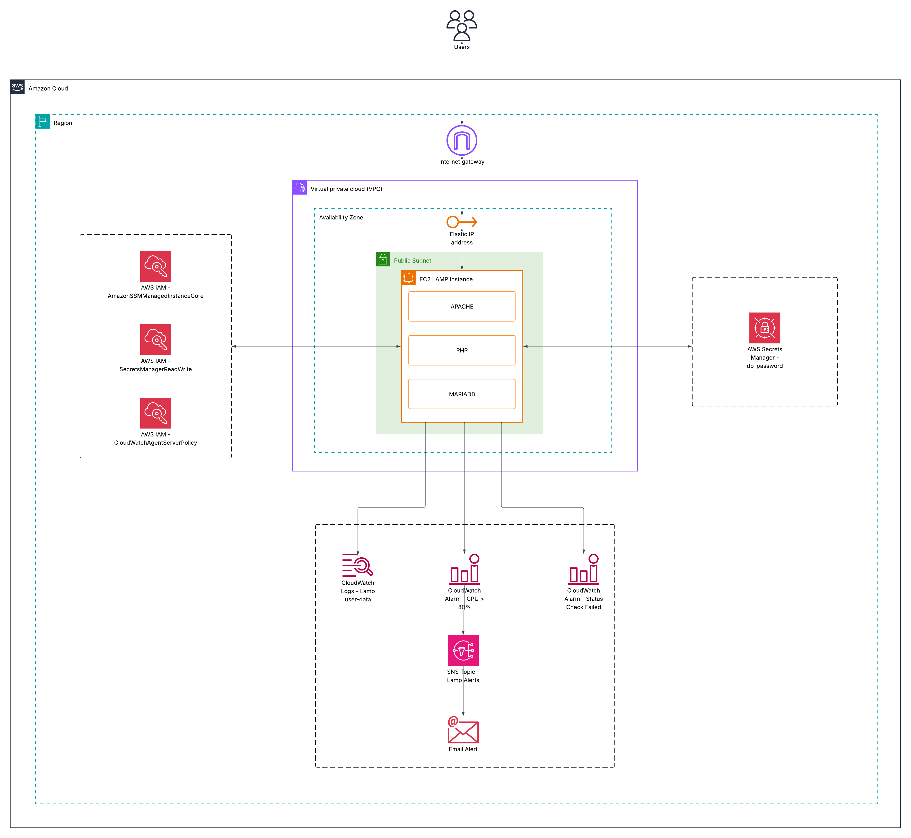
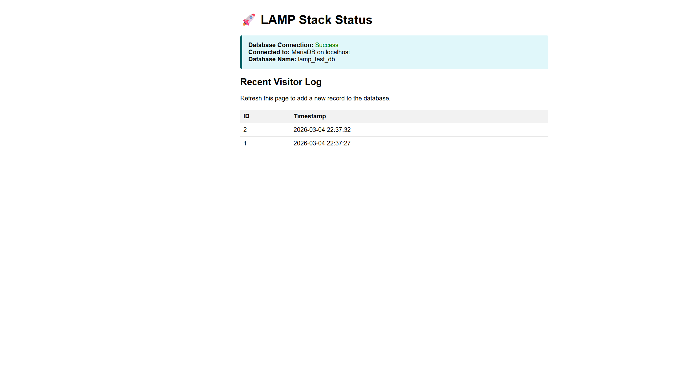
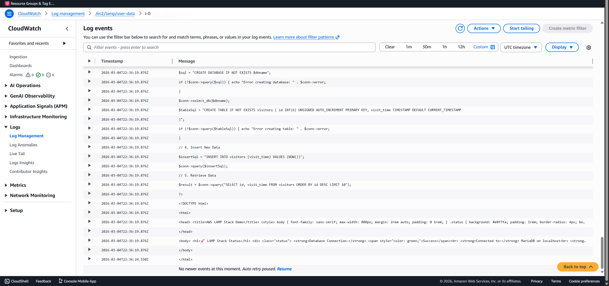

# Production-Ready AWS LAMP Stack with Terraform

[cite_start]This project automates the deployment of a highly secure, monitored, and self-configuring LAMP stack (Linux, Apache, MariaDB, PHP) on AWS using Terraform[cite: 11, 20]. 

[cite_start]Unlike a basic web server deployment, this architecture implements enterprise-grade security and observability practices, including keyless terminal access, dynamic secret resolution, and automated metric alerting[cite: 1, 3, 19].



## ⚠️ Security Note: Transit Encryption
[cite_start]**HTTP vs. HTTPS:** To keep this architecture lightweight and self-contained on a single EC2 instance, the web server currently serves traffic over Port 80 (HTTP)[cite: 8]. For a true production environment, you must secure data in transit by opening Port 443 (HTTPS) and provisioning an SSL/TLS certificate (e.g., using Let's Encrypt directly on Apache, or by placing the instance behind an AWS Application Load Balancer with AWS Certificate Manager).

## ✨ Advanced Features

* [cite_start]**Zero-Trust Compute (Keyless Access):** SSH (Port 22) is completely disabled[cite: 8, 9]. [cite_start]Terminal access is managed securely via AWS Systems Manager (SSM) Session Manager using strict IAM instance profiles[cite: 3, 4].
* **Dynamic Secrets Management:** The PHP application does not hardcode database credentials. [cite_start]It uses the AWS SDK to dynamically fetch the MariaDB password from AWS Secrets Manager at runtime[cite: 1, 19].
* [cite_start]**Automated Monitoring & Alerting:** An embedded CloudWatch Agent streams boot logs directly to AWS[cite: 1, 13]. [cite_start]Custom CloudWatch Metric Alarms monitor CPU Utilization and Instance Status, triggering SNS email notifications if thresholds are breached[cite: 14, 15, 16, 17].
* [cite_start]**Resilient Networking:** Deployed in a custom VPC with a dedicated Public Subnet, Internet Gateway, and an Elastic IP (EIP) to ensure the application's public address remains static across reboots[cite: 12, 22, 23, 24].

## 📂 Project Structure

| File | Description |
| :--- | :--- |
| `main.tf` / `provider.tf` | [cite_start]EC2 compute resources and AWS provider configuration (using AL2023)[cite: 11, 20]. |
| `vpc.tf` / `subnet.tf` / `sg.tf` | [cite_start]Custom networking, Route Tables, and Security Groups (Port 80 only)[cite: 8, 22, 23]. |
| `iam.tf` | [cite_start]IAM Roles and Policies for SSM, Secrets Manager, and CloudWatch access[cite: 3]. |
| `secrets.tf` | [cite_start]AWS Secrets Manager configuration for the database password[cite: 19]. |
| `cloudwatch.tf` | [cite_start]CloudWatch Log Groups, Metric Alarms, and SNS email subscriptions[cite: 13, 14, 15, 17]. |
| `install_lamp.sh` | [cite_start]**Bootstrapper:** Installs Apache/PHP-FPM/MariaDB, configures Composer, and writes the PHP application[cite: 1]. |
| `variables.tf` / `outputs.tf` | [cite_start]Environment variables and dynamic endpoint outputs[cite: 5, 10]. |

## 🛠️ Prerequisites

1. **Terraform:** v1.0+ installed on your local machine.
2. **AWS CLI:** Configured with valid credentials (`aws configure`).
3. [cite_start]*(Note: An SSH Key Pair is **not** required for this project, as access is managed securely via AWS SSM)*[cite: 3, 11].

## 🚀 Deployment Instructions

1.  **Initialize Terraform**
    Download the required AWS providers.
    ```bash
    terraform init
    ```

2.  **Review the Plan**
    See what resources will be created.
    ```bash
    terraform plan
    ```

3.  **Apply Configuration**
    Confirm the build. [cite_start]*(Note: You must provide a secure password for the database and an email address for CloudWatch alerts)*[cite: 21].
    ```bash
    terraform apply -var="db_password=YourSecurePassword123" -var="alert_email=your.email@example.com" --auto-approve
    ```

## 🔍 Verification

Once `terraform apply` completes:

1.  [cite_start]**Wait ~2-3 Minutes:** The instance needs time to boot, run `dnf update`, install packages, start PHP-FPM, and start Apache[cite: 1].
2.  [cite_start]**Check the Output:** Look for the `webserver_url` in your terminal[cite: 10]:
    ```
    webserver_url = "http://<ELASTIC-IP>/my-app.php"
    ```
3.  **Visit the URL:** Open the link in your browser.
    * You should see the **"🚀 LAMP Stack Status"** page.
    
    
    
    * Refresh the page multiple times to see new "Visit" records added to the MariaDB database automatically.
4.  **Confirm SNS Subscription:** Check the email inbox you provided. AWS SNS will send a "Subscription Confirmation" email. You must click the link to receive future CPU and Status Check alarms!
5.  **Verify CloudWatch Observability:**
    * [cite_start]**Application Logs:** Navigate to CloudWatch > Log Groups (`/ec2/lamp/user-data`) to view the fully automated boot and installation logs[cite: 13].
    
    

## 🧹 Cleanup

To avoid ongoing AWS charges, destroy the resources when you are finished:

```bash
terraform destroy -var="db_password=YourSecurePassword123" -var="alert_email=your.email@example.com"